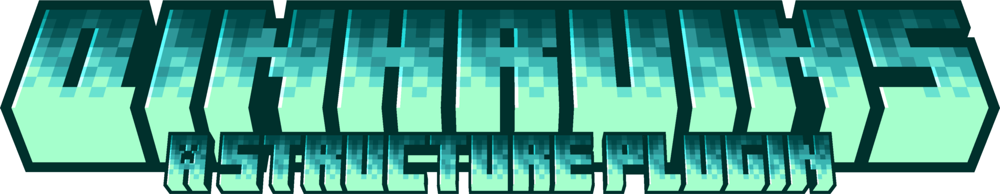

<p align="center"></p>

<p align="center">
  
  
  
  
</p>

<p align="center"><b>A procedural Roguelike ruin engine that grows living ruins right inside your world — no instances, no countdowns.</b></p>

---

**QinhRuins (QR)** makes structures **appear naturally** in your world. As players explore, they stumble onto an ancient tower, a sunken tomb, a floating sky island — walk close: mobs activate, mechanisms run, chests roll loot per-player. Clear it, and slot in a **Keystone** to inject affixes and turn it into a tiered **Realm endgame**.

QR is **not a dungeon plugin**. It **does not pull players into a separate world and does not run a countdown**. Ruins live in your main world, are part of it, and fade over time after clearing to free a slot for a new one — a **living, breathing world**.

> Built on **QinhCoreLib** (hard dependency). Optional plugins (MythicMobs, QinhClass / MMOCore, item plugins, economy, Citizens…) are auto-detected — missing ones degrade gracefully, no startup errors.

## ✨ Core Features

- 🌱 **Procedural natural generation** — weighted-draw spawning bounded by density / spacing / flatness / biome / dimension filters.
- 🧠 **Generation Director** — one scheduler runs weighted competition, living-world refresh, and post-clear fade & regen.
- 🏔️ **Terrain-fusion placement** — mask pasting, foundation fill + edge blending, marker blocks, frame-spread to avoid lag.
- 📐 **Blueprint gameplay layer** — spawn points, staged kill objectives, unlock chests, ruin cores, programmable mechanisms.
- ⚙️ **Programmable mechanisms** — 6 trigger types × 12 actions.
- 🗡️ **Final Boss Gate** — kill a cumulative count of designated mobs (vanilla + MythicMobs) to unlock and spawn the final boss.
- 🔑 **Keystone Realm endgame** — inject tier + affixes into a cleared ruin; reroll gambling, purification rewards, keystone ladder.
- 🎲 **Affix system** — five categories under a danger budget, mutually-exclusive groups, command / JS customization.
- 💎 **Loot system** — per-player or shared container loot, unlock chests, purification slot-machine, growth scaling, vanilla loot-table stacking.
- 🧭 **Guides & Codex** — guide compass to the nearest same-kind ruin, discovery codex.
- 🧩 **Sub-structure variants & tile assembly** — weighted variant slots + Tile Palette procedural assembly.
- 🖱️ **In-game visual editor** — box-select, mark, wire, save — no YAML.
- 🔌 **Stable API + events + scripting** — `QinhRuinsAPI`, lifecycle events, JS affix scripts, PlaceholderAPI.
- 🌍 **7 languages** — zh_cn / en_US / zh_tw / ru_RU / fr_FR / vi_VN / es_ES.

## 🚀 Quick Start

1. Install **QinhCoreLib** (hard dependency), then drop QinhRuins into `plugins/`.
2. Start the server — requires **Paper / Purpur / Spigot 1.21.11+**, **Java 25+**.
3. Use the in-game editor or the bundled `_example` template to create your first ruin.
4. `/qr scatter` to pre-generate, or just let players explore and find ruins naturally.
5. `/qr why` / `/qr gentest` if something doesn't generate.

## 📚 Documentation

Full Wiki & guides → **[QinhRuins Docs](https://jiulive.github.io/Qinh-docs/en/QR/)**

## 🛠️ Building

```bash
mvn clean package
```

The shaded jar is produced under `target/`. Requires JDK 25+.

## 📦 Requirements

| Item | Requirement |
|---|---|
| Server | Paper / Purpur / Spigot **1.21.11+** |
| Java | **25+** |
| Hard dependency | **QinhCoreLib** |
| Optional soft deps | MythicMobs, QinhClass / MMOCore, item plugins, PlaceholderAPI, economy plugins, Citizens |

---

*Part of the Qinhuai plugin series.*
